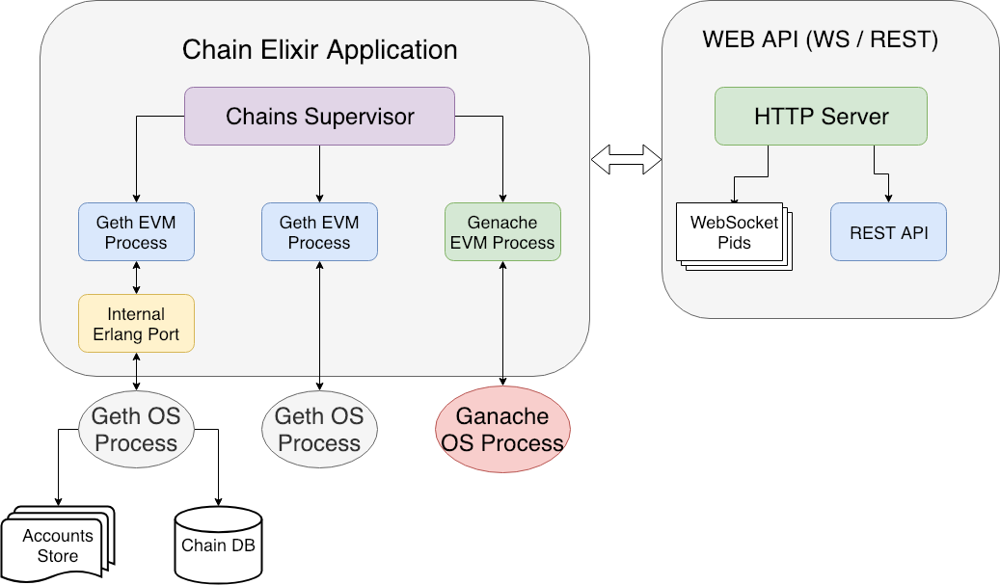

# TestChain
[](https://travis-ci.org/makerdao/ex_testchain)

This is Elixir MVP implementation of Testchain as a Service.

Right now it implements this features:

 - Start/stop new chain (`geth|ganache`)
 - Start/Stop mining process
 - Take/revert snapshot

Other documentation:
 - [Docker support](./docs/DOCKER_SERVICE.md)

## Requirements

 - Elixir 1.9+
 - Erlang 22+

## Installation

As for now project requires Elixir installed + chain you want to work with.

[**Installing Elixir**](https://elixir-lang.org/install.html)

For NixOS you will also need to install Erlang R21 to make `escript` available
```bash
$ nix-env -iA nixos.erlangR22
```

Installing project dependencies is easy:
```bash
$ mix do deps.get, deps.compile
```

Will install, compile all elixir dependencies and node.js for ganache


### Geth
ExTestchain uses `geth` installed in your system.

[**Installation**](https://github.com/ethereum/go-ethereum/wiki/Installing-Geth)

After this `geth` should be available in your system.

### Ganache
**Note that you have to use Node.js less than 12**
Ganache wouldn't work with node.js 12 !

ExTestchain uses local ganache-cli installation.

And `ganache-cli` added as git module to the project and you have to check it out.
```bash
$ git submodule init
$ git submodule update
```

After fetching it locally you have to install dependencies (if you didn't run `make deps`):

```bash
$ cd priv/presets/ganache-cli
$ npm install
```

## Docker support
For people who don't want to install everything on local machine there is Docker image provided.

All details are [here](./docs/DOCKER_SERVICE.md)
## How it's working



## Building

First you need to install dependencies. For elixir project it's done using command:
```bash
$ mix do deps.get, deps.compile
```

To build project you can use:

```bash
$ mix compile
```

To run it locally:
```bash
$ iex -S mix phx.server
```

This command will start project locally but for using a HTTP/WS server on port `4000`
you have to use `makerdao/staxx`

And it will become accessible from anywhere you need.

## Running ex_testchain

For your local instance you could use `make dev` command.
Be sure you installed Geth/Ganache

## Logging
For now ExTestchain uses logger in debug mode and all messages will be printed to your CLI.
To omit this uncomment logger level in `apps/chain/config/config.ex`

```elixir
config :logger, level: :info
```

And recompile your project

Happy testing ! :ghost:
